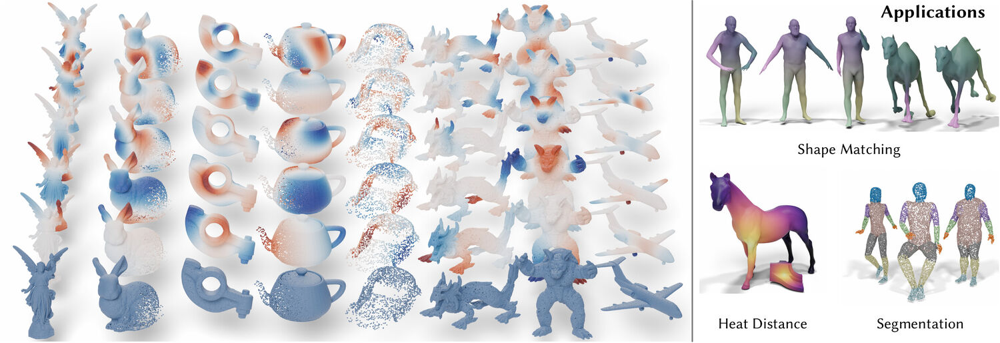
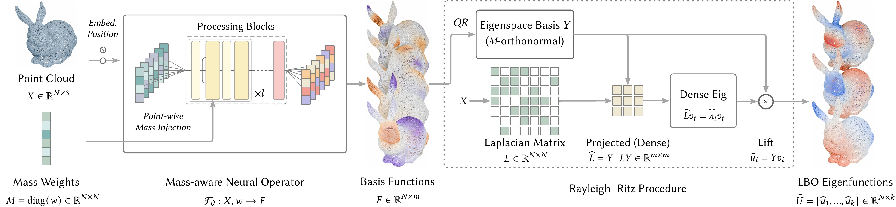
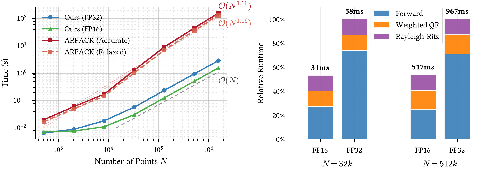
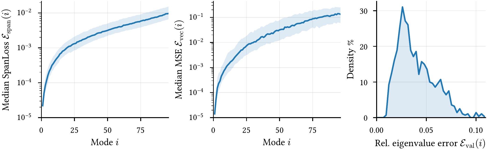
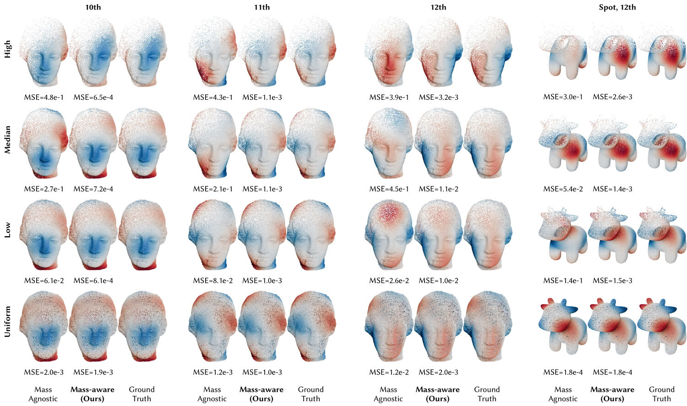
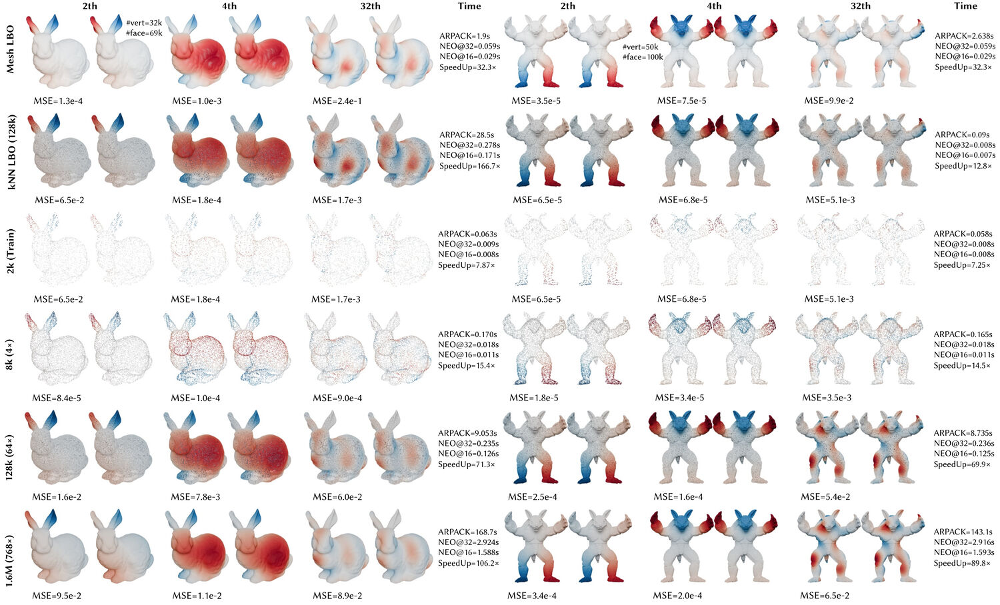
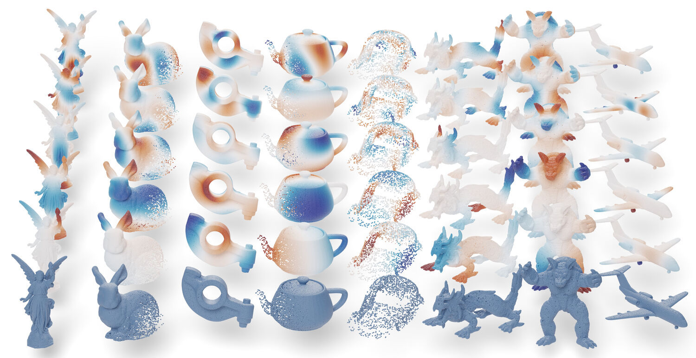
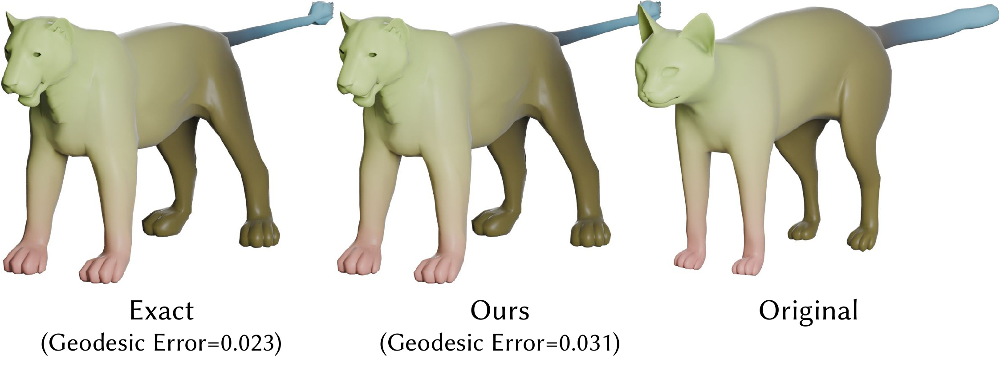
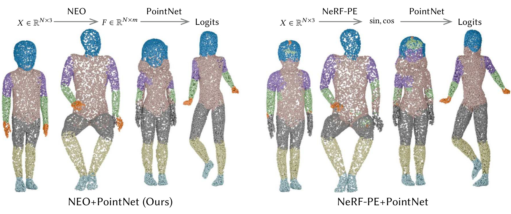
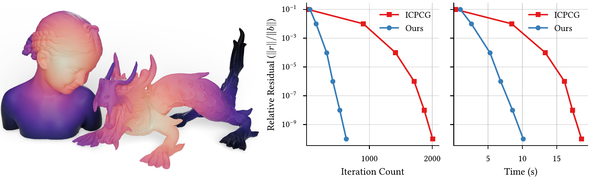

<h1 align="center">Aprendizaje del Autociespacio Laplaciano con<br>Operadores Neuronales Conscientes de Masa en Nubes de Puntos</h1>

<p align="center">
  <a href="https://github.com/Adversarr">Zherui Yang</a><sup>1</sup> &nbsp;&nbsp;
  <a href="https://people.iiis.tsinghua.edu.cn/~taodu">Tao Du</a><sup>2,3</sup> &nbsp;&nbsp;
  <a href="http://staff.ustc.edu.cn/~lgliu/">Ligang Liu</a><sup>1&dagger;</sup>
</p>
<p align="center">
  <sup>1</sup>Universidad de Ciencia y Tecnología de China &nbsp;&nbsp;
  <sup>2</sup>Universidad Tsinghua &nbsp;&nbsp;
  <sup>3</sup>Instituto Shanghai Qi Zhi
</p>
<p align="center">
  <b>SIGGRAPH 2026</b>
</p>
<p align="center">
  <!-- <a href="#"></a>
  <a href="#"></a> -->
  <a href="https://adversarr.github.io/NEO"></a>
  <a href="https://github.com/Adversarr/NEO"></a>
</p>

<p align="center">
  
</p>

**NEO (Operador Neuronal del Autociespacio)** es un marco de trabajo de propagación hacia adelante (feed-forward) que predice el autociespacio de Laplace-Beltrami de baja frecuencia directamente desde nubes de puntos, reemplazando costosos resolvedores propios iterativos con inferencia neuronal rápida y refinamiento Rayleigh-Ritz. Logra una **aceleración de 88x** sobre ARPACK a 512k puntos con un escalado de tiempo de ejecución **casi lineal** y generalización **zero-shot** desde 2k puntos de entrenamiento hasta 512k+ en inferencia.


## Aspectos Destacados

- **Aprendizaje de Subespacio:** Reformula la regresión de autovectores como predicción de subespacio invariante, resolviendo ambigüedades de inversión de signo y rotación.
- **Atención Consciente de Masa:** Inyecta pesos de área por punto en la atención cruzada, permitiendo un manejo robusto de densidades de muestreo no uniformes.
- **Escalado Casi Lineal:** Inferencia en O(N) para modos objetivo fijos, en comparación con O(N^1.16) para ARPACK.
- **Transferencia de Resolución Zero-Shot:** Entrenado en nubes de puntos de 2k, generaliza a más de 512k puntos sin ajuste fino.
- **Doble Utilidad:** Sirve tanto como un reemplazo rápido de resolvedor propio como un embedding intrínseco efectivo para puntos.


## Descripción del Método

<p align="center">
  
</p>

NEO toma como entrada una nube de puntos con pesos de masa por punto. Un operador neuronal consciente de masa predice funciones base redundantes en una sola pasada hacia adelante. Estas se M-ortonormalizan, luego el Laplaciano discreto se proyecta en el subespacio de baja dimensión. Un pequeño problema propio denso produce las autofunciones LBO finales mediante refinamiento Rayleigh-Ritz.


## Resultados

### Escalado de Tiempo de Ejecución

<p align="center">
  
</p>


### Precisión

<p align="center">
  
</p>


En el conjunto de prueba ShapeNet (k=96): pérdida media de subespacio (span loss) de 3.35e-3 (>99.7% de captura de energía espectral), estable bajo precisión mixta FP16.

### Robustez frente a Muestreo No Uniforme

<p align="center">
  
</p>

La atención consciente de masa previene la degradación catastrófica bajo muestreo sesgado, mientras que la línea base agnóstica a la masa falla.

### Transferencia Cruzada de Resolución y Discretización

<p align="center">
  
</p>

Transferencia zero-shot sólida desde entrenamiento de 2k hasta 1.6M puntos a través de diferentes discretizaciones del Laplaciano (malla de Delaunay intrínseca vs. grafo k-NN).

### Galería

<p align="center">
  
</p>

Predicciones de NEO en formas diversas fuera de distribución que abarcan criaturas orgánicas, modelos gráficos clásicos y piezas CAD fabricadas por el hombre.

## Aplicaciones

### Correspondencia de Formas mediante Mapas Funcionales

<p align="center">
  
</p>

### Segmentación (NEO + PointNet)

<p align="center">
  
</p>


### Distancia Geodésica Basada en Calor

<p align="center">
  
</p>


## Instalación

### Automática

```bash
./setup_conda.sh
```

### Manual

```bash
conda env create --name neo "python=3.12"
conda activate neo
pip install -r requirements.txt -r requirements-pyg.txt
pip install -e .
```

## Reproducción de Experimentos

Todos los resultados del artículo pueden reproducirse siguiendo los pasos a continuación. Los scripts se encuentran en `exp/launch/` y asumen que el entorno conda `neo` está activo y que `G2PT_DATA_ROOT` (o la variable relevante por conjunto de datos) apunta a su directorio de datos. ([pesos preentrenados](https://drive.google.com/drive/folders/12026qTECiGywESPz6WSbpgD8BPMd41Ha?usp=drive_link))

### 🌙 0. Bonus 
Más allá de la pipeline central del artículo, este repositorio también contiene algunas utilidades laterales y artefactos exploratorios que fueron útiles durante el desarrollo pero no forman parte de la ruta principal de reproducción.

- **Utilidades de renderizado en Blender:** `renders/` incluye scripts de Blender reutilizables y notas de comandos para reproducir visualizaciones de nubes de puntos y mallas estilo teaser/galería a partir de los generados.
- **Líneas base adicionales de desarrollo:** además de los checkpoints principales de NEO, la base de código aún incluye PointNet2, PointTransformer, position-only, RoPE y variantes de Transolver utilizadas en comparaciones internas.
- **Resultados exploratorios adicionales:** el repositorio también contiene figuras omitidas y scripts de análisis para casos de falla, ablaciones de tamaño de subespacio, gráficos resumidos de tareas descendentes y backends de resolvedores propios alternativos más allá de los resultados destacados del README.

### 1. Preparación de Datos

**Datos de pre-entrenamiento (ShapeNet).**
Descargue ShapeNet y ejecute el script de preprocesamiento para calcular los autovectores LBO por muestra y empaquetar todo en archivos HDF5:

```bash
python exp/pretrain_datagen/shapenet/preprocess.py \
    --input-dir  /path/to/ShapeNet \
    --output-dir /path/to/preprocessed_shapenet_h5 \
    --k 96 --n-samples 1024 --per-mesh-count 4 --num-workers 8
```

Establezca la ruta de salida como `G2PT_DATA_SHAPENET` (o exporte `G2PT_DATA_ROOT` y el script la derivará automáticamente).

**SHREC16 (clasificación).**  Descargue el conjunto de datos SHREC 2016 y preprocese los datos:

```bash
python exp/downstream/preprocess_shrec16_classification.py \
    --root-dir /path/to/shrec_16 \
    --output-dir /path/to/preprocessed_shrec16
```

**Correspondencia (mapas funcionales).**  Descargue el conjunto de datos de correspondencia y ejecute:

```bash
python exp/downstream/preprocess_corr.py \
    --root-dir /path/to/functional_mapping \
    --output-dir /path/to/preprocessed_corr \
    --k 128
```

**Segmentación humana.**  Descargue el Benchmark de Segmentación del Cuerpo Humano (SIG17) y preprocese los datos:

```bash
python exp/downstream/preprocess_human_sig17_seg_benchmark.py \
    --root-dir /path/to/human_seg \
    --output-dir /path/to/preprocessed_human_seg
```

---

### 2. Pre-entrenamiento

Entrene el modelo base de NEO en ShapeNet:

```bash
export G2PT_DATA_SHAPENET=/path/to/preprocessed_shapenet_h5
bash exp/launch/pretrain-base.sh
```

### 3. Tareas Descendentes (Downstream)

Cada script de tarea descendente carga un backbone preentrenado congelado (`freeze_pretrained=true`) y ajusta solo la cabeza de la tarea. Ejecútelos una vez completado el pre-entrenamiento.

**3a. Clasificación de Formas (SHREC16)**

```bash
bash exp/launch/downstream_classification_shrec16.sh
```

Esto recorre distintos tamaños del conjunto de entrenamiento `{30, 90, 120, 300, 480}` y ejecuta tres condiciones en paralelo para cada uno: NEO (con pre-entrenamiento), línea base PointNet y línea base PointTransformer. Los resultados se registran por `run_name`.

**3b. Correspondencia de Formas (Mapas Funcionales)**

```bash
bash exp/launch/downstream_correspondence.sh
```

Ejecuta dos condiciones: NEO con el backbone preentrenado (`freeze_pretrained=true`, `model_depth=6`) y una línea base solo con embedding de posición. Ambos usan `batch_size=32`.

**3c. Segmentación del Cuerpo Humano**

```bash
bash exp/launch/downstream_segment_human.sh
```

Ejecuta `exp/downstream/seg.py` con y sin el backbone preentrenado. El `run_name` distingue los resultados (`with-pretrain` vs. `no-pretrain`).

---

### 4. Inferencia y Evaluación

La familia de scripts `exp/pretrain/infer_*.py` evalúa un modelo entrenado contra los autociespacios LBO de referencia (ground-truth) y registra el tiempo, la pérdida de subespacio y las puntuaciones de similitud coseno para cada muestra. Use `infer.py` para entradas de nubes de puntos (con Laplaciano robusto) y `infer_mesh.py` para entradas de mallas triangulares:

```bash
# Inferencia de nubes de puntos (Laplaciano robusto)
python exp/pretrain/infer.py \
    --ckpt  /path/to/model.ckpt \
    --data_dir /path/to/test_samples \
    --glob  "*" \
    --device cuda

# Inferencia de mallas
python exp/pretrain/infer_mesh.py \
    --ckpt  /path/to/model.ckpt \
    --data_dir /path/to/test_samples \
    --device cuda

# Laplaciano de grafo k-NN (experimento de transferencia de discretización)
python exp/pretrain/infer_knn.py \
    --ckpt  /path/to/model.ckpt \
    --data_dir /path/to/test_samples \
    --device cuda
```

Cada script escribe los resultados por muestra (autovectores, tiempo, puntuaciones) bajo `<sample_dir>/inferred/` y un resumen `results.json`. Pase `--no-mass` para ablar la atención consciente de masa en tiempo de inferencia. Para evaluación de precisión mixta, los resultados FP16 se producen automáticamente junto con FP32 cuando hay un dispositivo CUDA disponible.

Las estadísticas de tiempo de ejecución (Tabla 1 en el artículo) se pueden recopilar y graficar con:

```bash
python exp/pretrain/get_stats_from_validation.py
python exp/pretrain/plot_stats.py
```

---

## Citación

Si encuentra este trabajo útil, por favor cite:

```bibtex
@article{yang2026neo,
  title={Learning Laplacian Eigenspace with Mass-Aware Neural Operators on Point Clouds},
  author={Yang, Zherui and Du, Tao and Liu, Ligang},
  journal={ACM Transactions on Graphics (Proc. SIGGRAPH)},
  year={2026}
}
```
